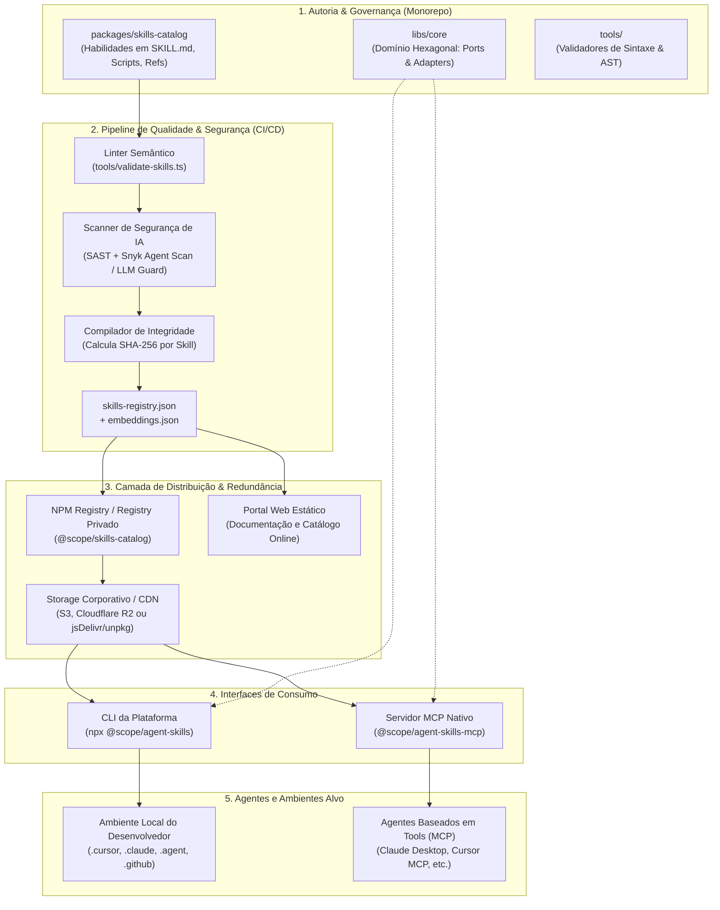
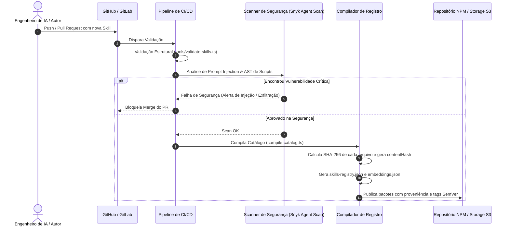
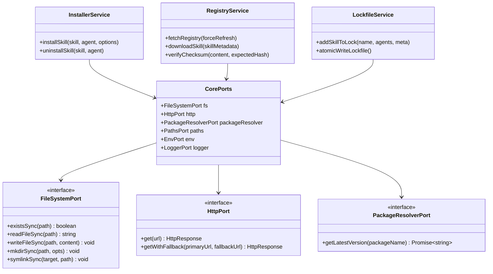
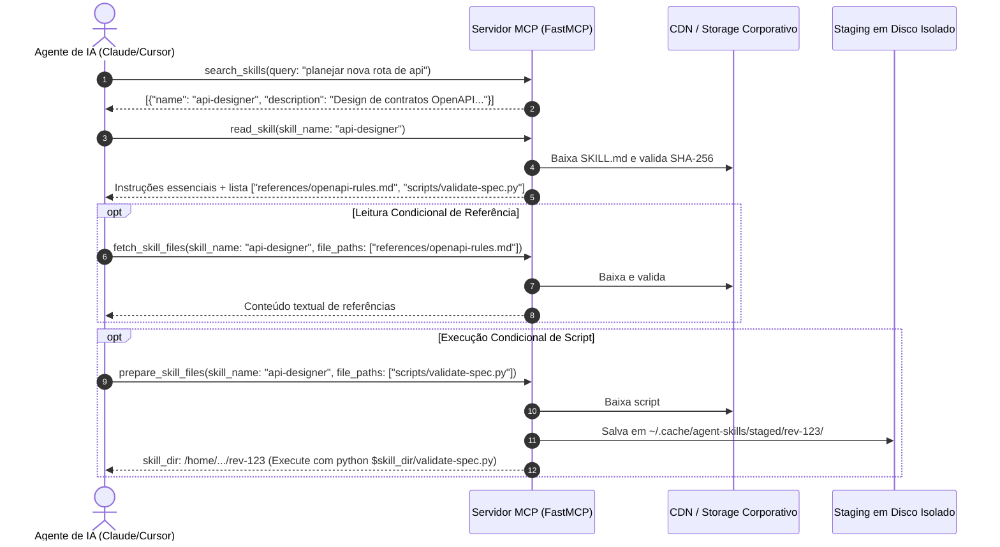

# Blueprint de Arquitetura: Plataforma de Registro, Validação e Entrega de Skills & MCP para Agentes de IA
**Projeto:** *Agent Skill Platform (ASP) / Open Agent Skills Engine*  
**Autor:** Engenharia de Arquitetura de Software  
**Status:** Aprovado para Implementação  
**Versão:** 1.0.0  

---

## 1. Visão Executiva & Desafios de Engenharia

O crescimento acelerado de agentes autônomos de codificação (como Cursor, Claude Code, Antigravity, GitHub Copilot, Windsurf, Cline, entre outros) revelou três problemas críticos na engenharia de software assistida por IA:

1. **Fragmentação de Ecossistemas:** Cada ferramenta de IA define convenções próprias de diretórios e formatos para instruções customizadas (ex: `.cursor/rules`, `.claude/skills`, `.agent/skills`), forçando desenvolvedores e times a duplicar configurações manualmente.
2. **Riscos de Supply Chain & Prompt Injection:** Habilidades disponibilizadas publicamente na web não passam por triagem de segurança. Relatórios recentes de segurança indicam que mais de 13% de scripts e prompts de terceiros contêm vetores de exfiltração de dados (chaves de API, variáveis de ambiente), chamadas a comandos destrutivos ou vulnerabilidades a jailbreak.
3. **Inchaço de Contexto (*Context Bloat*):** Injetar regras extensas e manuais inteiros no *system prompt* do LLM consome cotas de tokens desnecessariamente, introduz latência e reduz a acurácia do modelo.

### Objetivos da Plataforma (ASP)
- **Universalidade:** Capacidade de catalogar e entregar habilidades a qualquer agente de mercado via CLI ou via protocolo MCP (*Model Context Protocol*).
- **Progressive Disclosure:** Expor apenas sumários e instruções de primeiro nível; carregar referências e ferramentas especializadas estritamente sob demanda.
- **Segurança Hardened:** Triagem estática na esteira de CI/CD contra injeções de prompt e adulteração, com verificação de integridade ponta a ponta (checksum criptográfico SHA-256).
- **Prontidão Corporativa (Enterprise-Ready):** Suporte a ambientes sem acesso direto à internet (*air-gapped*), espelhos internos (*mirrors* privados via S3/Artifactory) e execução isolada (*sandbox*).

---

## 2. Topologia do Sistema e Arquitetura Geral

A plataforma é desenhada sob o modelo de **Monorepo Modular** com publicação desacoplada de artefatos.



---

## 3. Especificação do Formato Canônico da Skill

Para garantir portabilidade total, cada skill reside em um diretório próprio e segue a especificação padronizada de arquivos:

```text
packages/skills-catalog/skills/
└── (categoria)/
    └── nome-da-skill/
        ├── SKILL.md                 # [OBRIGATÓRIO] Instruções essenciais e metadados
        ├── references/              # [OPCIONAL] Documentos técnicos carregados sob demanda
        │   └── manual-tecnico.md
        ├── templates/               # [OPCIONAL] Modelos de código para scaffold
        │   └── boilerplate.ts
        └── scripts/                 # [OPCIONAL] Scripts utilitários de automação
            └── executor.py
```

### 3.1. O Arquivo `SKILL.md`
O arquivo `SKILL.md` é estruturado em duas partes: **YAML Frontmatter delimitado** e o **Corpo de Instruções**.

```yaml
---
name: feature-planner
description: Structured feature planning framework. Use when asked to specify architecture, decompose user stories into atomic tasks, or plan refactorings. Do NOT use for quick single-line bug fixes.
metadata:
  version: 1.0.0
  author: Architecture Team
  license: Apache-2.0
compatibility:
  min_agent_tier: 1
  requires_terminal: true
sandbox:
  network: false
  allow_exec: false
---

# Instruções da Skill
1. Analise o contexto do repositório antes de propor soluções.
2. Formule o plano em 4 fases: Especificação, Design de Arquitetura, Tarefas Atômicas e Implementação.
3. Se referências detalhadas forem necessárias, consulte `references/fases.md`.
```

### 3.2. Regras Estritas de Validação de Skills
O validador da esteira de CI/CD impõe:
- **Ausência de `README.md` na pasta da skill:** Skills são direcionadas a LLMs, não a humanos. Guias de onboarding dentro da pasta poluem o espaço semântico do agente.
- **Tamanho Limite do Corpo:** O corpo do `SKILL.md` não deve exceder 500 linhas. Conteúdos enciclopédicos devem ser fragmentados na subpasta `references/`.
- **Gatilhos Obrigatórios no `description`:** A descrição deve conter explicitamente **frases de ativação** (*"Use when..."*) e **escopo negativo** (*"Do NOT use for..."*). Isso garante que o agente evite ativações falsas-positivas.
- **Nomenclatura Kebab-case:** Todas as pastas e arquivos devem adotar `kebab-case` estrito.

---

## 4. Esteira de Integração Contínua e Segurança de Supply Chain



### Checklist do Security Gatekeeper:
1. **Deteção de Jailbreaks e Prompt Injection:** Verificação com `snyk-agent-scan` ou modelo de moderação local avaliando tentativas de substituição de instruções do sistema (*system prompt override*).
2. **Auditoria de Scripts Executáveis:** Varredura estática em scripts Python/Shell na pasta `scripts/` impedindo chamadas a `rm -rf /`, piping de scripts remotos (`curl | bash`), acesso direto a chaves de ambiente críticas (`AWS_SECRET_ACCESS_KEY`, `OPENAI_API_KEY`).
3. **Imutabilidade e Assinatura:** Cada versão publicada é acompanhada de um manifesto de hashes SHA-256. Clientes finais rejeitam arquivos cujo hash baixado divirja do manifesto oficial.

---

## 5. Arquitetura do Core (`libs/core`) — Ports & Adapters

Para garantir que a lógica de negócios seja independente de plataforma operacional ou provedor de rede, o núcleo do sistema adota a **Arquitetura Hexagonal**:



### Componentes Chave da Biblioteca:
- **`RegistryService`:** Resolve versões do catálogo, faz download concorrente de arquivos de skills com limite de concorrência (ex: 10 requisições simultâneas), valida o SHA-256 em memória antes da persistência e gerencia o cache local com TTL de 24 horas.
- **`InstallerService`:** Identifica os diretórios de configuração dos agentes instalados no sistema, lida com criação segura de *symlinks* (ou cópias literais caso o SO restrinja symlinks) e assegura que nenhum caminho saia do diretório de destino (*path traversal protection*).
- **`LockfileService`:** Mantém o arquivo `.skill-lock.json` em nível de repositório, garantindo reproducibilidade nas máquinas dos desenvolvedores do time e suportando reversão atômica em caso de interrupção abrupta do processo.

---

## 6. Mecanismos de Entrega aos Agentes

A plataforma entrega as habilidades através de dois canais de consumo:

### 6.1. Canal Estático: CLI de Instalação (`@scope/agent-skills`)
A CLI pode ser executada em modo interativo (com interface visual construída em React via **Ink**) ou via modo script/headless para integração contínua:

```bash
# Execução direta via npx
npx @scope/agent-skills install --skill feature-planner --agents cursor claude-code antigravity

# Suporte a escopo global ou local por projeto
npx @scope/agent-skills install --skill aws-architect --global

# Atualização de todas as skills instaladas baseando-se no lockfile
npx @scope/agent-skills update
```

#### Mapeamento Multi-Agente (Exemplo de Diretórios Alvo):
| Agente | Escopo Local (Projeto) | Escopo Global (Usuário) |
| :--- | :--- | :--- |
| **Cursor** | `.cursor/skills/` | `~/.cursor/skills/` |
| **Claude Code** | `.claude/skills/` | `~/.claude/skills/` |
| **Antigravity** | `.agent/skills/` | `~/.gemini/antigravity/skills/` |
| **GitHub Copilot** | `.github/skills/` | `~/.copilot/skills/` |
| **Windsurf** | `.windsurf/skills/` | `~/.codeium/windsurf/skills/` |
| **Cline** | `.cline/skills/` | `~/.cline/skills/` |

---

### 6.2. Canal Dinâmico: Servidor MCP (`@scope/agent-skills-mcp`)
Para agentes modernos com suporte a ferramentas dinâmicas via **Model Context Protocol**, não é necessário clonar arquivos na árvore de código do projeto. O agente inicializa o servidor MCP via `stdio`:

```json
{
  "mcpServers": {
    "agent-skills": {
      "command": "npx",
      "args": ["-y", "@scope/agent-skills-mcp"],
      "env": {
        "ASP_REGISTRY_URL": "https://meu-registro-privado.empresa.com/skills"
      }
    }
  }
}
```

#### O Fluxo de Progressive Disclosure do MCP:
1. **`search_skills(query, category)`:** Realiza busca híbrida (Fuzzy Match com `Fuse.js` + similaridade de cosseno via embeddings pré-calculados) sobre o catálogo em memória. Retorna apenas títulos e resumos curtos.
2. **`read_skill(skill_name)`:** Faz o fetch sob demanda do arquivo `SKILL.md`, verifica seu hash SHA-256 e entrega as instruções primárias ao LLM, informando também quais arquivos de `references/` estão disponíveis caso o agente decida consultá-los.
3. **`fetch_skill_files(skill_name, file_paths)`:** Chamada apenas quando o agente decide que precisa ler um guia técnico específico de `references/`. Evita consumir janela de contexto se a tarefa for simples.
4. **`prepare_skill_files(skill_name, file_paths, dry_run)`:** Se a habilidade contiver scripts executáveis (`scripts/`), esta ferramenta faz o staging desses arquivos em um diretório temporário isolado do usuário (`~/.cache/agent-skills/staged/<revision-hash>/`), fornecendo ao agente o caminho absoluto para execução sem expor código bruto dezenas de vezes no contexto.



---

## 7. Diferenciais e Recursos Corporativos Avançados (Enterprise-Ready)

Para mitigar os pontos fracos identificados em modelos puramente públicos da web, esta arquitetura incorpora três avanços mandatórios:

### 7.1. Suporte a Espelhos Privados e Ambientes Sem Internet (*Air-Gapped*)
Em vez de apontar de maneira fixa para CDNs públicos externos, os clientes CLI e MCP resolvem a URL do catálogo através da seguinte cadeia de prioridades:
1. Variável de ambiente `ASP_REGISTRY_URL` (apontando para bucket interno S3, JFrog Artifactory ou Nexus).
2. Campo `registryUrl` no arquivo de configuração global `~/.agent-skills/config.json`.
3. Fallback padrão para a CDN global pública.

### 7.2. Busca Semântica Híbrida (Embeddings no Build)
Para evitar falhas da busca textual léxica (quando o usuário usa sinônimos que não estão no texto do título), o pipeline de CI compila:
- `skills-registry.json`: Dados cadastrais e hashes.
- `embeddings.json`: Vetores densos (usando um modelo de embeddings leve como `text-embedding-3-small` ou `all-MiniLM-L6-v2`) gerados para a descrição de cada skill.
- O MCP carrega esses vetores e, em milissegundos, executa o cálculo de similaridade de cosseno em memória diretamente no Node.js/WASM, retornando as skills mais relevantes mesmo sem correspondência exata de palavras.

### 7.3. Sandbox de Execução de Scripts
Para scripts disponibilizados via `prepare_skill_files`, o ambiente corporativo pode ativar o flag `ASP_EXECUTION_MODE=container`, onde qualquer script gerado por uma skill é montado em um container Docker efêmero sem privilégios de rede, garantindo isolamento total contra acessos indevidos à máquina local.

---

## 8. Estrutura de Diretórios Recomendada para o Repositório

```text
agent-skills-platform/
├── .github/
│   └── workflows/
│       ├── ci.yml                 # Lint, testes unitários, testes PBT
│       ├── security-scan.yml       # Scanner Snyk / LLM Guard
│       └── release.yml             # Nx Release e publicação NPM/Storage
├── libs/
│   └── core/                      # Domínio compartilhado (Arquitetura Hexagonal)
│       ├── src/
│       │   ├── lib/
│       │   │   ├── ports/         # Interfaces (FileSystem, Http, Env, Resolver)
│       │   │   ├── adapters/      # Implementações concretas Node.js
│       │   │   ├── services/      # Installer, Registry, Lockfile, Agents, Audit
│       │   │   └── types/
│       │   └── index.ts
│       └── project.json
├── packages/
│   ├── skills-catalog/            # Catálogo oficial de habilidades
│   │   ├── skills/
│   │   │   ├── (architecture)/
│   │   │   ├── (security)/
│   │   │   ├── (testing)/
│   │   │   └── (product)/
│   │   ├── src/
│   │   │   ├── compile-catalog.ts # Compilação de hashes e json
│   │   │   └── scan-skills.ts     # Scanner de segurança
│   │   └── package.json
│   ├── cli/                       # Ferramenta de linha de comando
│   │   ├── src/
│   │   │   ├── ui/                # Componentes React (Ink)
│   │   │   ├── commands/          # install, update, remove, list, audit
│   │   │   └── index.ts
│   │   └── package.json
│   ├── mcp-server/                # Servidor Model Context Protocol
│   │   ├── src/
│   │   │   ├── tools/             # search_skills, read_skill, fetch, prepare
│   │   │   ├── server.ts          # Inicializador FastMCP
│   │   │   └── index.ts
│   │   └── package.json
│   └── portal-web/                # Portal de Documentação (Next.js SSG)
│       └── ...
├── tools/
│   ├── validate-skills.ts         # Validador de conformidade e frontmatter
│   └── skill-generator/          # Gerador de boilerplate de novas skills
├── nx.json
├── package.json
└── tsconfig.base.json
```

---

## 9. Plano de Implementação (Fases de Execução)

| Fase | Escopo de Entrega | Principais Entregáveis |
| :--- | :--- | :--- |
| **Fase 1: Fundação & Domínio** | Configuração do monorepo Nx, tipagens estritas TypeScript e biblioteca `libs/core` com portas e adaptadores Node. | `libs/core` com testes unitários e property-based testing (`fast-check`). |
| **Fase 2: Catálogo & Segurança** | Desenvolvimento do compilador de catalog (`compile-catalog.ts`), regras de validação estrutural (`validate-skills.ts`) e integração com `snyk-agent-scan`. | Catálogo inicial com 5 a 10 skills canônicas, geração de SHA-256 e esteira de CI com verificação bloqueante. |
| **Fase 3: CLI de Instalação** | Implementação da CLI interativa (Ink) e modo não-interativo com suporte a symlink/cópia para Cursor, Claude Code, Antigravity e Copilot. | Pacote `@scope/agent-skills` publicado no registro de pacotes com testes end-to-end. |
| **Fase 4: Servidor MCP** | Criação do servidor FastMCP implementando o padrão de *Progressive Disclosure* e staging seguro de arquivos para execução. | Pacote `@scope/agent-skills-mcp` com suporte a `stdio` para clientes de IA. |
| **Fase 5: Extensões Enterprise** | Suporte a mirrors privados via `ASP_REGISTRY_URL`, busca híbrida com embeddings pré-calculados e documentação estática. | Portal web e suporte a ambientes corporativos isolados (*air-gapped*). |
